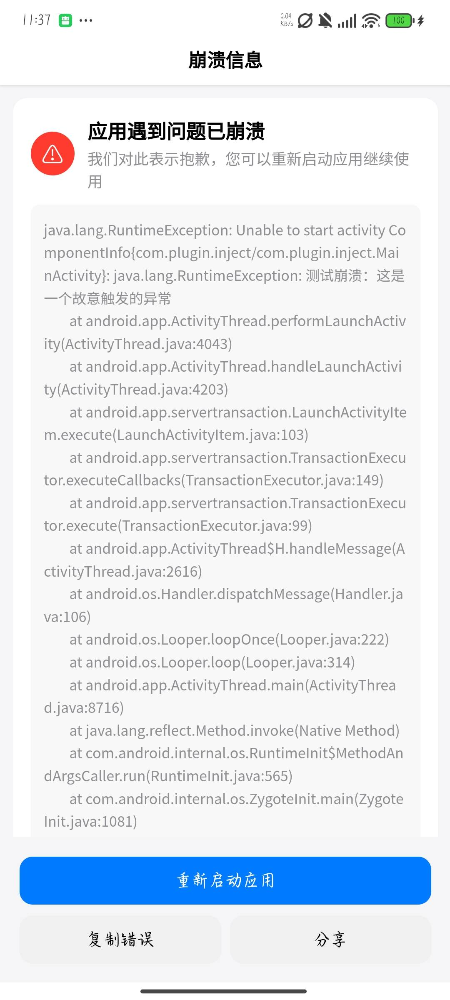

# 崩溃记录拦截日志

## 使用教程:

### 先下载release.apk包

### 使用MT管理器或其他逆向软件

### 查看release.apk包中的dex文件，删除com.plugin.inject.MainActivity类

### 把dex文件的文件名改成你想注入的apk的dex的后缀数字的最后一位+1，例如classes8.dex，则你把release.apk里面的classes改成9

### 把classes移动到要注入的apk里面，还有assets也移动过去

### 最后把要注入的apk里面的classes里面的main类的onCreate里面写上调用代码

### 调用代码为：invoke-static {p0}, Lcom/plugin/inject/crash/CrashUtil;->init(Landroid/content/Context;)V

## 效果图：

## 项目对各位朋友有帮助的话能否赏个star，拜托拜托了
